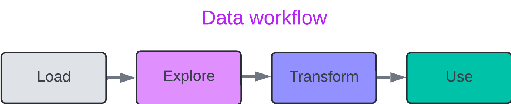
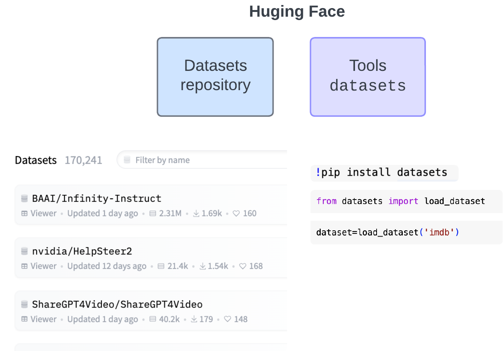

# Meet the HF datasets

<details>

<summary>Content</summary>

[outline-schedule.md](outline-schedule.md "mention")

</details>

### Topics

| Data: the start of it all                       |
| ----------------------------------------------- |
| Sneak peak at datasets                          |
| Getting started with the datasets library       |
| Datasets 🤝 Arrow                               |
| Most common datasets for tasks                  |
| Exploring dataset structures                    |
| Dataset splits and formats                      |
| Data filtering and processing                   |
| Advanced data manipulations                     |
| Batching and iterating                          |
| Loading custom datasets                         |
| Streaming datasets                              |
| Questions to ask before starting with a dataset |

### Sneak peak at datasets



<mark style="color:purple;">What we will cover:</mark>

* <mark style="color:purple;">where are datasets at Hugging face</mark>
* <mark style="color:purple;">what is the data workflow</mark>&#x20;
* <mark style="color:purple;">what to use for data workflow with Hugging Face</mark>


***

> #### Problem 1
>
> **I need data. Can to get my data in Hugging Face?**&#x20;
>
> Data is the start of it all: it defines everything you do in your project. Hugging Face is amazing place as has lot of datasets that we can use to jump start building great things AI.


> #### Problem 2
>
> **I found my data, but how can I work with it using Hugging Face tools?**
>
> What you most commonly want to do with the data is to load it, explore and prep (or transform) your data for further use = put it in the model!&#x20;
>
>

***

To summarise:

<figure><figcaption><p>Data workflow</p></figcaption></figure>

Let's have a closer look at datasets at Hugging Face and see how we can use data workflow with the `datasets` library.

We can find datasets at this special Datasets section at Hugging Face [here](https://www.google.com/url?q=https%3A%2F%2Fhuggingface.co%2Fdatasets) and we also have support for our data workflow in the datasets library . So you see we have both - data repos and tools to work with data.

<figure><figcaption><p>Hugging Face repos and library</p></figcaption></figure>

When I am not sure how to do something related to data at Hugging Face, I always go and check docs [here](https://huggingface.co/docs/datasets/index)

I really like this library: it makes working with data simplifies how to access and work with myriads of datasets for an ML/AI project.

### Getting started with the datasets library

<mark style="background-color:purple;">Need:</mark> <mark style="background-color:purple;"></mark><mark style="background-color:purple;">`https://huggingface.co/datasets/stanfordnlp/imdb`</mark>&#x20;

Let's start our second Hugging Face project. In&#x20;


<mark style="color:purple;">What we will cover:</mark>

* <mark style="color:purple;">install the library</mark>
* <mark style="color:purple;">load datasets, and</mark>
* <mark style="color:purple;">perform basic operations such as exploring and filtering data.</mark>


Welcome back!  Let's dig into coding: data and datasets library!

&#x20;In the previous video we started with datasets at Hugging Face, talked about the ML data flow and started our second project. Now - more coding!

We work with one of the most remarkable datasets at Hugging Face: `imdb` dataset [here](https://huggingface.co/datasets/stanfordnlp/imdb) . The IMDB Movie Reviews dataset is sourced from the Internet Movie Database (IMDB) and contains 50,000 highly polarized reviews.

Let's go to the Hugging Face website and have a look at its dataset card.

We can have a quick look at the dataset even without loading it using **Dataset Viewer** and read about the dataset under the [Dataset Summary ](https://huggingface.co/datasets/stanfordnlp/imdb#dataset-card-for-imdb). We see that the dataset includes two columns: text and label.

As you see on the `Splits` view, the dataset is evenly split into 25,000 reviews for training and 25,000 reviews for testing, with each set having an equal number of positive and negative reviews. Each review typically includes:

* **Review Text**: The main body of the review written by the user.
* **Sentiment Label**: A binary label indicating the sentiment of the review (positive or negative).

The size of the dataset is 50,000 reviews, which is manageable and comprehensive for NLP tasks.

But let's go to Google Colab and start coding.

We need to install the `datasets` library first and ensure that we have integration with \```huggingface_hub`,``

```python
!pip install datasets 
!pip install huggingface_hub
```

We will use load\_dataset function to get our data straight from Hugging Face. There are also other ways to load data using this library, we will look at them later.

```python
from datasets import load_dataset 
dataset=load_dataset("imdb")
print(dataset)
```

`load_dataset` will download the dataset to your local computer

We have training and testing splits in our data - which are subsets of data we can use for training and testing. So let's look at them

```python
train_dataset=dataset['train']
test_dataset=dataset['test']
train_dataset
test_dataset
```

We also can load just a particular split that we are interested in using

```
train_dataset = load_dataset("imdb", split="train")
```

and by the way - if you are running this code locally and want to check where this dataset goes on your computer, we can check the cache location:

```python
from datasets import config

print(config.HF_DATASETS_CACHE)
```

This will print the cache directory and we can go there. In our case we are using Google Colab so it shows:

```python
/root/.cache/huggingface/datasets
```

Let's look at the structure of the train\_dataset.&#x20;

```python
train_dataset.column_names
train_dataset.features
```

as you see we have two categories of the `label` that is negative coded as 0 and positive ones coded as 1.

So when to use which of those attributes?&#x20;

Notice that `column_names` returns a list of strings with where each string is the name of a column.&#x20;

`features` returns a dictionary where the keys are the column names and the values describe the type and other properties of each column. &#x20;

I usually use `column_names`to to quickly see the structure of the dataset or use column names in the code.

Notice that we cannot use either of these attributes on the full dataset.

```python
dataset.column_names
dataset.features
```

&#x20;This is because the dataset object itself can contain multiple splits, and each can have different structures. We will talk more about the dataset objects later.

We can look at individual observations in the dataset to get a fill of data:

```python
train_dataset[0]
```

which returns the first observations, get a range of observations using

```python
train_dataset[range(20)]
```

what do you think we are going to get if we pull up `train_dataset[-1]`? Yes, the last observation.

We can also use a column name to get a list of values in that column:

<pre class="language-python"><code class="lang-python"><strong>train_dataset["text"]
</strong></code></pre>

If we need, we can rename columns using

```python
dataset_new = train_dataset.rename_column("text", "review")
```

Again, we cannot do this on the full dataset since it is a `DatasetDict` object.

Lastly, let's have a look at filtering. We can do this using the `filter` method with a `lambda` function, such as&#x20;

retrieve positive reviews or filtering reviews with a specific movie title (and looking at first 3 of them)

<pre class="language-python"><code class="lang-python"># Filter positive reviews (label == 1) from the training dataset
<strong>positive_reviews = train_dataset.filter(lambda x: x['label'] == 1)
</strong>print(positive_reviews[:5])

# Filter reviews containing a specific movie title (e.g., 'Inception')
movie_title_reviews = train_dataset.filter(lambda x: 'inception' in x['text'].lower())
print(movie_title_reviews[:3])  #
</code></pre>

Great! so now we know how to&#x20;

* install the `dataset`library
* load datasets from `HuggingFace`
* start exploring our dataset
* and do some basic transformations with it

<mark style="color:purple;">**Let's move to the next video!**</mark>




Now that you are all setup, the first step is to load a dataset. The easiest way to load a dataset is from the [Hugging Face Hub](https://huggingface.co/datasets). There are already over 900 datasets in over 100 languages on the Hub. Choose from a wide category of datasets to use for NLP tasks like question answering, summarization, machine translation, and language modeling. For a more in-depth look inside a dataset, use the live [Datasets Viewer](https://huggingface.co/datasets/viewer/).

#### 1. Installation

First, ensure you have the `datasets` library installed. If not, you can install it using pip.

`! pip install datasets`


\# 1. Installing Required Libraries# First, let's install the necessary libraries.!pip install datasets!pip install huggingface\_hub

***

\[ ]#load imdb datasetfrom datasets import load\_datasetdataset=load\_dataset("imdb")# https://huggingface.co/datasets/stanfordnlp/imdbprint(dataset)

***


We are going to work with `imdb` datasets created at Stanford NLP lab.  l love this dataset as it is very simple but at the same time it is big and quite diverse, so we can use it to demonstrate some basic exploration and data prepping.

Let's have a look at the dataset more closely using the Hugging Face website:

We can see some basic information about the dataset in the dataset card.

We also can explore the dataset using Data Viewer on the website and we can see that the dataset has already 3 splits: train, test, and unsupervised split which  is the full dataset with labels removed. But let's start coding:


***

\[ ]# training splittrain\_dataset=dataset\['train']

***

\[ ]test\_dataset=dataset\['test']

***

\[ ]train\_dataset.column\_names

***

\[ ]train\_dataset.features

***

\[ ]train\_dataset\[0]train\_dataset\[-1]

***

\[ ]dataset\[0]

***

\[ ]dataset\['test']\[0]

***

\[ ]positive\_reviews=train\_dataset.filter(lambda x: x\['label']==1)print(positive\_reviews)

***

\[ ]

```
p=train_dataset.filter(lambda x: x['label']==1)
```

***

\[ ]

```
train_dataset.select(range(1000))[1:50]
```

***

arrow\_upwardarrow\_downwardlinkcommenteditdeletemore\_vert\


#### Do:

* [ ] Open your Google Collab and use the code above to install the \`datasets\` library.
* [ ] Verify the installation by importing the library with

`import datasets`

#### 2. Loading a Dataset



Make sure to check the previous section and setup your API key in GoogleColab to prevent annoying warning


We'll start by loading a dataset from the Hugging Face Hub. For this example, let's use the `imdb` dataset. Lets's see where we can find this dataset on the website first!

```
from datasets import load_dataset

# Load the IMDB dataset
dataset = load_dataset('imdb')
```

#### Hands-on Exercise 2

1. In a Python script or Jupyter notebook, load the `imdb` dataset using the code above.
2. Print the loaded dataset to see its structure.

#### 3. Exploring the Dataset (10 minutes)

Once the dataset is loaded, we can explore its contents. This includes viewing the dataset's structure, columns, and a few examples.

```
# View the dataset
print(dataset)

# Access a specific split
train_dataset = dataset['train']

# Check the structure
print(train_dataset.column_names)
print(train_dataset.features)
print(train_dataset[0])
```

#### Hands-on Exercise 3

1. Access the `train` split of the `imdb` dataset.
2. Print the column names and features of the `train` split.
3. Print the first example in the `train` split.

#### 4. Filtering and Selecting Data (10 minutes)

Filtering and selecting data is crucial for preparing datasets for training models. We'll learn how to filter the dataset based on specific conditions.

```
# Filter the dataset to only include positive reviews
positive_reviews = train_dataset.filter(lambda x: x['label'] == 1)

# Select a subset of columns
subset = train_dataset.select(range(1000))
```

#### Hands-on Exercise 4

1. Filter the `train` split of the `imdb` dataset to include only positive reviews.
2. Select the first 1000 entries from the `train` split.
3. Print a few examples from the filtered and selected datasets.
